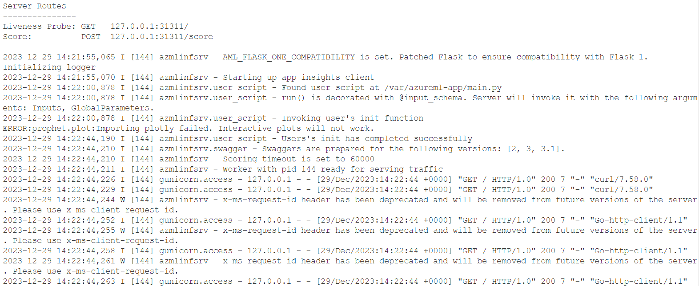
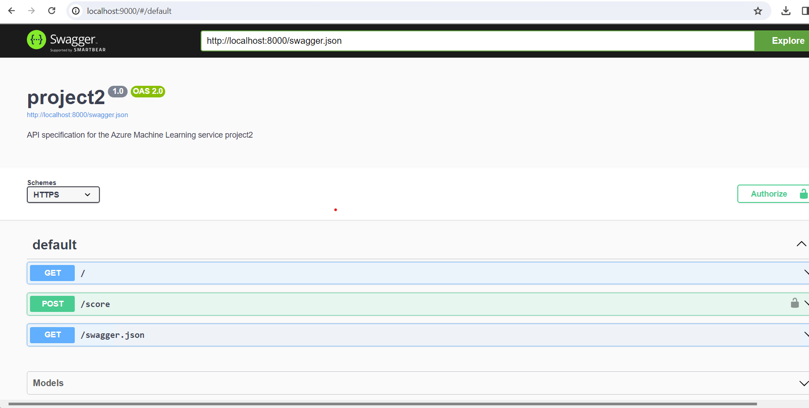

*NOTE:* This file is a template that you can use to create the README for your project. The *TODO* comments below will highlight the information you should be sure to include.

# Your Project Title Here

This project is to deploy a machine learning model as a service in Azure Machine Learning Studio. Then try to consume it, mornitor it with Application Insight logging, document with Swagger. Finally create, publish and consume the machine learning Pipeline.

## Architectural Diagram

## Key Steps
1. Create AutoMl model
    a. Register dataset
    
    b. Create compute cluster    
    c. Create automl experiment
    
    d. Run the experiment

2. Choose the best model to deploy
    
3. Monitoring the service with Application Insight logging feature
    
    
4. Create the RESTful documentation for the service using Swagger
    
5. Consume the endpoint 
    
6. Create the AutoML Pipeline
    
## Screen Recording
[Screencast](https://www.youtube.com/watch?v=8lUfjOYHcHM)

## Standout Suggestions
Create a website to use the endpoints with friendly interaction with users.
