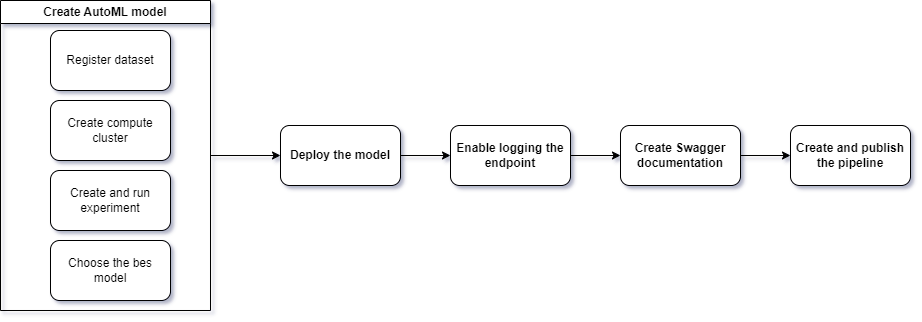

*NOTE:* This file is a template that you can use to create the README for your project. The *TODO* comments below will highlight the information you should be sure to include.

# Your Project Title Here

This project is to deploy a machine learning model as a service in Azure Machine Learning Studio. Then try to consume it, mornitor it with Application Insight logging, document with Swagger. Finally create, publish and consume the machine learning Pipeline.

## Architectural Diagram

## Key Steps
1. Create AutoMl model
    a. Register dataset
    b. Create compute cluster
    c. Create automl experiment
    d. Run the experiment
2. Choose the best model to deploy
3. Run code for logging the endpoint
4. //TODO Swagger
5.
6.

## Screen Recording
*TODO* Provide a link to a screen recording of the project in action. Remember that the screencast should demonstrate:

## Standout Suggestions
Create a website to use the endpoints with friendly interaction with users.
