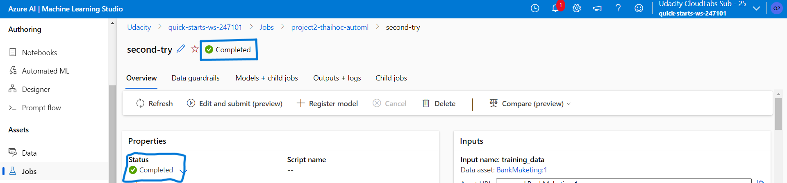
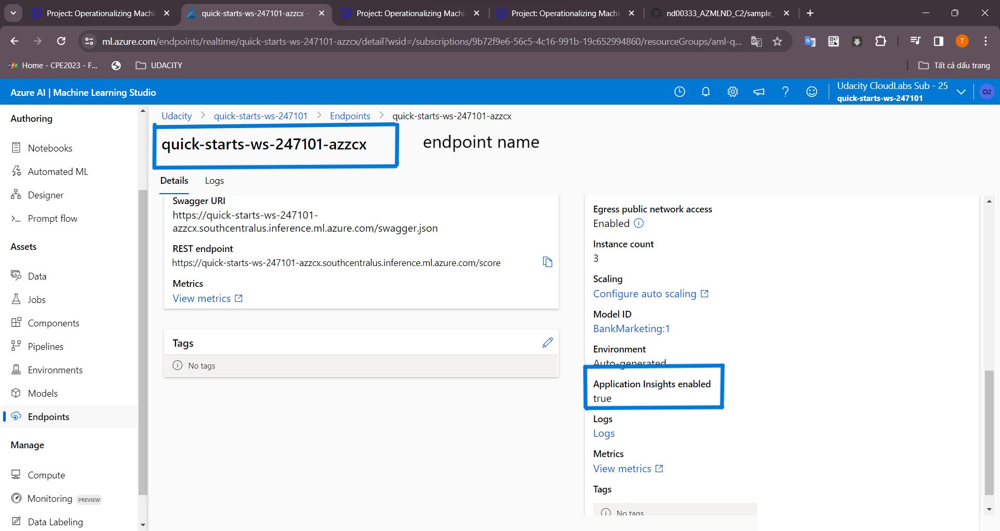

*NOTE:* This file is a template that you can use to create the README for your project. The *TODO* comments below will highlight the information you should be sure to include.

# Your Project Title Here

This project is to deploy a machine learning model as a service in Azure Machine Learning Studio. Then try to consume it, mornitor it with Application Insight logging, document with Swagger. Finally create, publish and consume the machine learning Pipeline. The model is trained with azure AutoML pipeline and deploy as a service. We can consume the service for web application or other uses with RESTful API.

## Architectural Diagram

## Key Steps
### Deploy model in Azure ML Studio
#### Create a new AutoML run
1. “Registered Datasets” in ML Studio shows "Bankmarketing" dataset available
    
2. The experiment is shown as completed.
    

#### Deploy a model and consume a model endpoint via an HTTP API

1. Endpoints section in Azure ML Studio, showing that “Application Insights enabled” says “true”.
    
2. Logging is enabled by running the provided logs.py script
    
3. Swagger runs on localhost showing the HTTP API methods and responses for the model
    
4. endpoint.py script runs against the API producing JSON output from the model.
    

### Publish an ML Pipeline
#### Create and publish a pipeline
1. The pipeline section of Azure ML studio, showing that the pipeline has been created
    
2. The Bankmarketing dataset with the AutoML module
    

3. The “Published Pipeline overview”, showing a REST endpoint and a status of ACTIVE
    

#### Configure a pipeline with the Python SDK

#### Use a REST endpoint to interact with a Pipeline
1. ML studio showing the pipeline endpoint as Active

2. ML studio showing the scheduled run *However, I cant find schedule status.*

## Screen Recording
[Screencast](https://www.youtube.com/watch?v=8lUfjOYHcHM)

## Standout Suggestions
Create a website to use the endpoints with friendly interaction with users.
